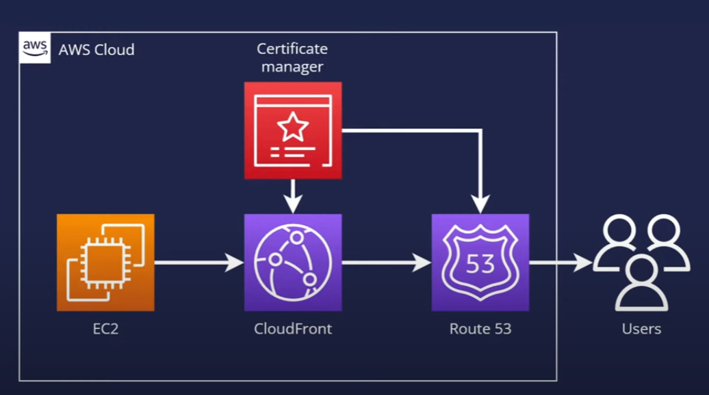

# AWS Secure and powerful architecture for a Static Website

Use this solution to create a secure static website for a registered domain name. With this solution, The website:

- Is Deployed as a docer container 
- Is hosted on [Amazon EC2](https://aws.amazon.com/ec2/)
- Is distributed by [Amazon CloudFront](https://aws.amazon.com/cloudfront/)
- Uses an SSL/TLS certificate from [AWS Certificate Manager (ACM)](https://aws.amazon.com/certificate-manager/)
- Uses [CloudFront Response Header Policies](https://docs.aws.amazon.com/AmazonCloudFront/latest/DeveloperGuide/adding-response-headers.html) to add security headers to every server response

The architecture for this project is shown below:



1. The viewer requests the website at www.example.com.
2. If the requested object is cached, CloudFront returns the object from its cache to the viewer.
3. If the object is not in CloudFront’s cache, CloudFront requests the object from the origin (an EC2 inistance).
4. EC2 returns the object to CloudFront
5. CloudFront caches the object.
6. The object is returned to the viewer. Subsequent responses for the object are served from the CloudFront cache.


## deploy the Website

1- install [Docker]([https://aws.amazon.com/ec2/](https://docs.docker.com/engine/install/ubuntu/))


2. Clone the repositories

   ```shell
           git clone https://github.com/medoston/oman-Learnnig-Website.git

   ```

3. change directory to the repo folder
   ```shell
           cd oman-Learnnig-Website/
   ```

4. Run Docker command to build the docker file

   ```shell
           docker build -t oman . 
   ```

5. Run Docker command to run the image on port 80 

   ```shell
           docker run -d -p 80:80 --name OM oman 
   ```


   
